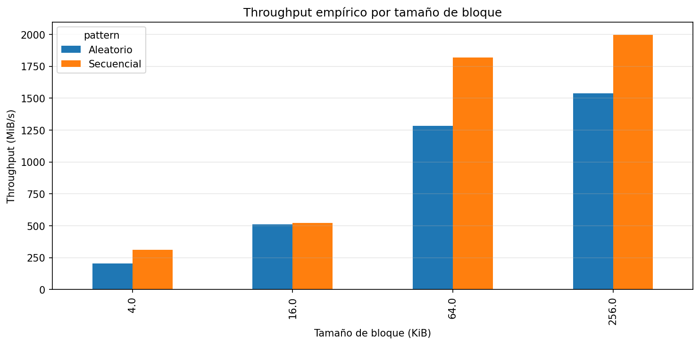
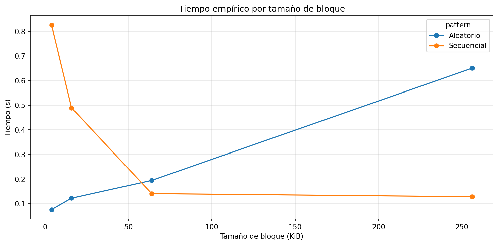
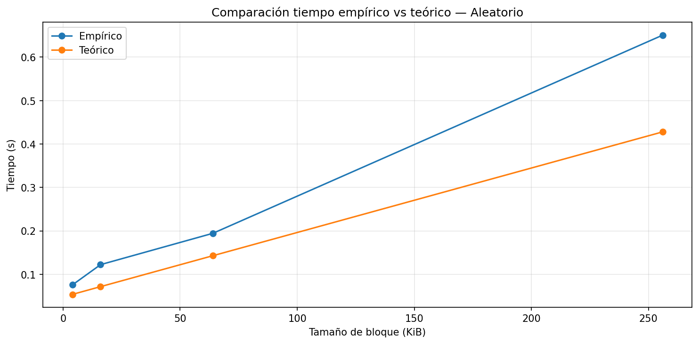
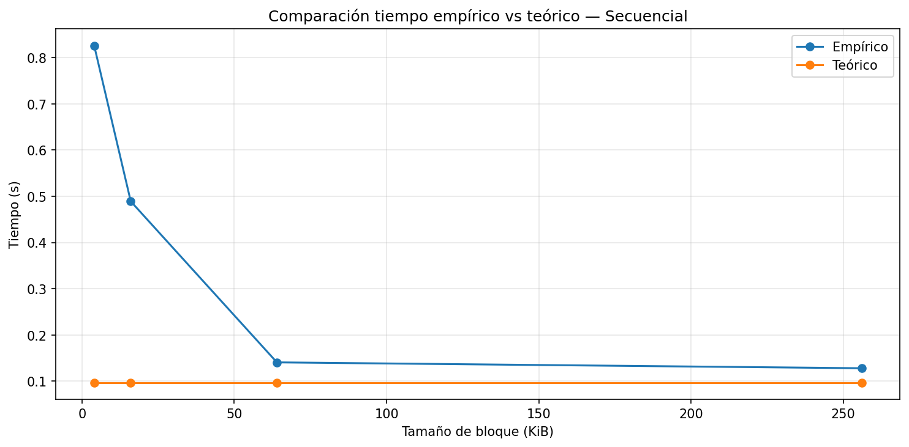

# Las especificaciones de mi sistema

| Parámetro                         | Valor observado                       |
|----------------------------------|----------------------------------------|
| Sistema Operativo                | Windows 11                             |
| CPU (Modelo y Frecuencia)        | AMD Ryzen 5 3500U 2.10 GHz             |
| Arquitectura y Núcleos           | x64 / 4 núcleos físicos                |
| Memoria RAM Total                | 8 GB DDR4                              |
| Tecnología de Almacenamiento     | SSD NVMe (Non-Volatile Memory Express) |
| Carga de CPU en Reposo (%)       | 3%                                     |

# Resultados del experimento

 

  

  

  

# Análisis y conclusiones

Con base en las mediciones, puedo observar que el acceso secuencial fue mucho más rápido que el acceso aleatorio en todos los tamaños evaluados. Por ejemplo, en los bloques de 256 KiB, el throughput (rendimiento) secuencial dio como resultado 1997.334806 MiB/s, mientras que el aleatorio dio como resultado 1537.167953 MiB/s, lo que representa que fue:
```text
1997.334806 MiB/s / 1537.167953 MiB/s = 1.29 o ~ 1.30
```
veces más rápido. En tamaños como 64 KiB la diferencia también es notable, porque el valor secuencial es de 1817.50 MiB/s y el aleatorio de 1284.94 MiB/s, lo que indica que es 1.41 veces más rápido.

Esto coincide con lo esperado en la teoría, ya que el acceso secuencial minimiza la latencia de búsqueda, mientras que el acceso aleatorio realiza múltiples accesos independientes, aumentando el costo total de la operación. Por lo tanto, concluyo que los conceptos teóricos se validan con los resultados prácticos encontrados.

El throughput(rendimiento) del acceso aleatorio mostró una mejora significativa al aumentar el tamaño de bloque esto lo vemos en 206.148435 MiB/s en 4 KiB a 1537.167953 en 256 KiB lo que representa un gran incremento. esto se explica por la amortización de la latencia, ya que el costo fijo asociado a cada operación de acceso se distribuye sobre una mayor cantidad de datos transferidos. a medida que aumenta el tamaño de bloque, el sistema se aproxima a su límite de throughput reduciendo el peso de la latencia en el tiempo total.

Un caso donde se vio diferencia fue en bloques pequeños como 4 KiB, donde el tiempo real fue mayor que el que decía el modelo teórico. Esto significa que el modelo subestima el tiempo real. Esto pasa porque en la práctica hay cosas que el modelo no tiene en cuenta, como el trabajo del sistema operativo o procesos que están corriendo al mismo tiempo, lo que hace que todo sea un poco más lento.

Por los resultados obtenidos, especialmente los valores cercanos a 2000 MiB/s en acceso secuencial, se puede decir que el equipo se comporta como un SSD NVMe. Esto es porque esos valores son mucho más altos que los de otros tipos de disco como los HDD o los SSD más antiguos.

Si tuviera que trabajar con una tabla de 1 millón de registros, elegiría leerla de forma secuencial, ya que es más rápida. Como se vio en los resultados, este tipo de acceso alcanza mejores velocidades (1997.334806 MiB/s frente a 1537.167953 MiB/s). Leer los datos uno por uno de forma aleatoria tomaría más tiempo porque cada acceso seria un retraso.

## Conclusion


La informacion del disco se almacena en bloques y esa organizacion es demasiado importante porque el costo de ingresar a datos depende de los bytes que se leen, si no tambien de como están se distribuyen.

En este experimento logramos confirmar que el acceso secuencial es mas eficente que el aleatorio, especialmente cuando los bloques son grandes porque se reduce búsquedas y aprovecha mejor la lectura reduciendo la latencia, mientras que el aleatorio requiere realizar grandes saltos aumentando el acceso incluso en un SSD.

el acceso secuencial alcanzó cerca de 2000 MiB/s en bloques de 256 KiB, mientras que el aleatorio llegó aproximadamente a 1530 MiB/s, mostrando una diferencia clara de rendimiento.

con base en lo medido, en un sistema real se debería priorizar el uso de accesos secuenciales y bloques grandes para mejorar el throughput y reducir el impacto de la latencia. En conclusión, tanto el patrón de acceso como el tamaño de bloque son determinantes en el rendimiento del almacenamiento.

